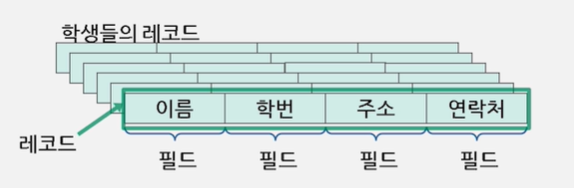
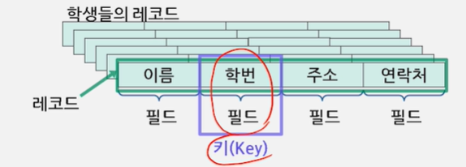

# 검색트리(이진검색트리, 레드블랙트리)

## 레코드
- ### 개체에 대해 수집된 모든 정보를 포함하고 있는 저장단위
  - 사람의 레코드
    - 주민번호, 이름, 집주소, 등등...
## 필드
- ### 레코드에서 각각의 정보를 나타내는 부분
  - 이름, 학번, 주소, 연락처...
# 
## 키, 검색키
- ### 다른 레코드와 중복되지 않도록 각 레코드를 대표할 수 있는 필드
  - 키는 하나의 필드로 이루어질 수도 있고 두 개 이상의 필드로 이루어질 수도 있음
# 
---
## 검색트리
- 자료를 저장하고 검색하는 데에 유용한 자료구조이며 알고리즘임
- 레코드를 트리 모양으로 만들어서 자료를 저장하고 찾음
- 각 노드가 규칙에 맞도록 하나씩의 키를 갖고 있음
- 1:n 관계의 비선형 자료구조
- 계층 관계로 만들어진 계층형 자료구조
## 검색트리의 요소
- ### 노드 : 트리를 구성하는 요소
- ### 간선 : 노드를 연결하는 선
- ### 루트 노드 : 트리의 시작 노드
- ### 부모 노드
- ### 자식 노드
- ### 차수 : 자식 노드 수
- ### 레벨 : 특정 깊이를 가지는 노드의 집합. 위에서부터 레벨 0으로 시작
- ### 리프 노드 : 단말노드 차수가 0인 노드
## 검색트리의 종류
- ### 자식 노드의 개수에 따른 분류
  - 이진검색트리 : 최대 두 개의 자식 노드
  - 다진검색트리 : 세 개 이상의 자식노드로 분기
---
## 이진검색트리
- ### 최대 두 개의 자식 노드를 가짐
- ### 특성
  - 각 노드는 하나씩의 키 값을 가짐
  - 각 노드의 키 값은 다름
  - 최상위 레벨에 루트 노드가 있거, 각 노드는 최대 두 개의 자식을 가짐
  - 임의의 노드의 키 값은 자신의 왼쪽 자식 노드의 키 값보다 크고, 오른쪽 자식의 키값보다 작음
## 이진검색트리 검색방법
- 1단계 : 키 x를 가진노드를 검색함
- 2단계 : 트리에 키 x를 가진 노드가 존재하면 해당 노드를 리턴
- 3단계 : 존재하지 않으면 null 리턴
```
treeSearch(t, x)
// t는 서브트리의 루트 노드
// x: 검색하고자 하는 키
if(t == null or key[t]=x) {
    then return t;
}
if (x < key[t]>) {
    then return treeSearch(left[t], x)
else {
    return treeSearch(right[t], x)
}
}
```
## 이진검색트리 삽입방법
- 1단계 : 이진검색트리 검색 방법을 이용
- 2단계 : 원소 x가 이진검색트리에 없는지 확인
- 3단계 : 더 이상 내려갈 곳이 없으면 x를 그 노드의 자식에 매담
```
treeInsert(t, x) {
    if (t=null) then {
        key[r] = x;
        left[r] = null;
        right[r] = null;
        return r;    
    }
    if (x < key[t]) {
        them {left[t] = treeInsert(left[t], x;
        return t;
        }
    }
    else {
        right[t] = treeInsert(right...)
    }
}
```
## 이진트리 균형 문제
- ### 균형잡힌 이진트리
- ### 기울어진 이진검색트리