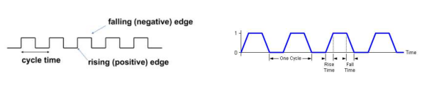
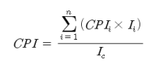
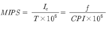
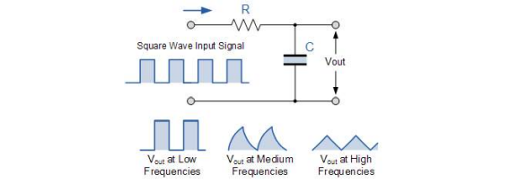

# Topic : 컴퓨터 개요

## 1. 전자계산기 정의
- ### 산술 또는 논리연산을 자동으로 실행할 수 있는 장치
  - 기계식 계산기로 시작하여 전자회로를 사용한 계산기로 발전
    - EDPS
  - 현대 전자 계산기는 컴퓨터로 총칭
## 1.1 전자 계산기의 진화
-  ### 단순 계산 장치에서 인간과 같은 학습능력과 사고능력을 가진 시스템으로 진화 중
   -  계산기에서 지능을 가진 컴퓨터로 진화
## 2. 컴퓨터 기능
- ### 데이터 입출력 기능
  - 전자 계산기 외부로부터 데이터를 받거나 내보는 기능
  - 전자 계산기와 외부 장치를 연결하는 통로 역할
- ### 데이터 저장 기능
  - 외부로부터 받은 데이터나 내부에서 처리한 결과 데이터를 저장장치에 보관하는 기능
- ### 데이터 처리 기능
  - 외부로부터 받은 데이터나 내부에 저장된 데이터를 내부 연산 장치를 사용하여 데이터값을 변경하는 기능
## 3. 컴퓨터 응용분야
- ### 컴퓨터 응용 분야
  - 다양한 응용분야에 사용될 수 있도록 설계된 **범용 컴퓨터** 분야와 특정 용도에 최적화된 **특정용도 컴퓨터**로 구분할 수 있다.
## 3.1 범용 컴퓨터
- ### 다양한 응용 분야의 소프트웨어를 실행할 수 있도록 범용 구조를 가진 컴퓨터
  - 범용성, 유연성을 강조
  - 특정 용도에 비해 성능이 떨어짐
  - PC, 워크스테이션, 메인프레임
## 3.2 특정용도 컴퓨터
- ### 특정 응용분야에 맞춰 하드웨어와 소프트웨어가 최적화된 컴퓨터
  - 임베디드 시스템
- ### 실생활에서 사용하는 대부분의 전기전자 시스템에서 특정 용도 컴퓨터를 사용
  - 가정용 전자제품
  - 사무용 기기
  - 공장 자동화 기기
  - 항공, 우주, 군사 장비
# Topic : 컴퓨터 구성
## 1. 컴퓨터 구성
- ### 컴퓨터는 하드웨어와 소프트웨어로 구성
  - 하드웨어 : 컴퓨터를 구성하는 물리적인 부품으로, 전자 및 기계장치를 말함
    - 고 비용, 성능향상
  - 소프트웨어 : 하드웨어가 수행할 작업을 지시하거나 수행 흐름을 제어하는 프로그램을 말함
    - 저 비용, 시스템 유연성 제공
## 2. 컴퓨터 하드웨어
- ### 컴퓨터 하드웨어는 중앙처리장치, 메모리, 주변장치, 버스로 구성
  - 중앙처리장치 : 데이터 처리
  - 메모리 : 데이터 저장
  - 주변장치 : 데이터 입출력, CPU 보조, 시스템 동작 지원
  - 버스 : 구성요소들간의 상호 연결
  - CPU + 메모리 --버스-- 주변장치
## 2.1 마이크로 프로세서
- ### CPU를 내장한 집적회로
  - 반도체 집적기술 발전으로, 마이크로 프로세서에 메모리와 주변장치를 같이 포함시켜, 단일 칩 컴퓨터 구현이 가능

## 3. 소프트웨어
- ### 소프트웨어
  - 컴퓨터 프로그램
    - 특정 목적 달성을 위해 순서적으로 배치된 CPU 명령어들의 집합
    - 처리할 데이터들의 이동 경로 및 처리방법을 기술
  - 저장장치(HDD)에 실행파일 형태로 저장되어 있다가 실행시에 메모리(반도체 메모리)로 로딩되어 실행
## 3.1 시스템 소프트웨어
- ### 컴퓨터 시스템 하드웨어를 관리하거나 프로그램 개발에 필요한 프로그램
  - 초기화 프로그램 : 부트로더
  - 운영체제 :
    - 컴퓨터의 하드웨어 자원의 효율적 관리
    - 프로그램 실행환경 제공
  - 프로그램 개발 도구
    - 프로그램 생성 및 디버깅 : 코드 편집기, 컴파일러, 인터프리터, 디버거 등
## 3.2 응용 소프트웨어
- ### 응용 소프트웨어
  - 사용자가 정의한 작업을 수행하는 프로그램
    - 어플리케이션 또는 앱
  - 시스템 소프트웨어의 도움을 받아 개발되고 실행
## 3.3 플랫폼
- ### 응용 소프트웨어의 실행환경을 제공하는 하드웨어 또는 소프트웨어
- ### 하드웨어 플랫폼
  - 윈도우 플랫폼, 리눅스 플랫폼, 모바일 플랫폼
- ### 소프트웨어 플랫폼
  - Java Platform : 자바 프로그램 실행환경
  - BREW : 모바일 프로그램 실행환경
## 3.4 미들웨어
- ### 운영체제와 응용 SW 사이에 필요한 서비스를 제공하는 SW
- ### 소프트웨어 프레임워크
  - 특정 응용분야의 프로그램 개발에 필요한 추상화된 소프트웨어 구조체
    - 라이브러리, API, 유틸리티 프로그램
## 3.5 펌웨어
- ### 비휘발성 메모리에 내장된 소프트웨어
  - MROM, EPROM, EEPROM, 플래시 메모리
- ### 펌웨어 용도
  - 개발이 완료되어 추가 변경 가능성이 낮은 소프트웨어의 영구 저장
    - 컴퓨터 하드웨어 제어에 필요한 필수 프로그램
      - PC의 ROM-BIOS
    - 각종 전자기기의 내장형 소프트웨어
  - 프로그램 코드 보호 수단으로 활용 가능
    - ROM의 접근제어 기능을 활용하여 외부에서 프로그램 코드 접근 제한
- ### 펌웨어 변경방법
  - 하드웨어에 RE-WRITE
    - 소프트웨어보다 유연성이 부족
  - 최근에는 응용 프로그램을 운영체제 없이 하드웨어상에서 직접 실행하도록 설계하는 방식을 말하기도 함

## 3.6 HW/SW 공조설계
- ### 전자 계산기의 H/W 특성과 S/W 특성을 조합하여 최적의 시스템을 설계하는 방법
  - H/W 특성 : 고성능, 고비용
  - S/W 특성 : 유연성, 저비용
- ### 시스템의 설계비용 최소화, 시스템 성능 향상
- ### 전자 계산기 하드웨어와 소프트웨어를 이해하고 공조설계(CO-DESIGN)이 가능한 고수준 설계자 필요
---
# Topic : 컴퓨터 분류
## 1. 컴퓨터의 분류방법
- ### 세대별 분류
  - 구현기술에 따른 시대적 분류
- ### 데이터 처리방식에 따른 분류
- ### 마이크로 프로세서 유형에 따른 분류
  - 사용 목적에 따른 마이크로 프로세서 유형
## 2. 세대별 분류
- ### 1세대(1946~1957) : 진공관
- ### 2세대(1958~1964) : 트랜지스터
- ### 3세대(1965, 1971) : 집적 회로(IC), SSI
- ### 4세대(1972~1977) : LSI
- ### 5세대(1978~1991) : VLSI
- ### 6세대(1991~현재) : ULSI
## 3. 데이터 처리방식에 따른 분류
- ### 일괄 처리 방식(Batch Processing)
  - 여러 개의 프로그램을 사전에 정해진 순서에 따라 차례로 실행하는 방식
  - 실행중인 프로그램이 종료될 때까지 다른 프로그램을 실행할 수 없다.
- ### 시분할 처리 방식
  - 여러 개의 프로그램을 스케줄링을 통하여 CPU를 시간적으로 분할하여 사용하는 방식
    - 가상적으로 여러 개의 프로그램이 동시에 실행되는 효과
    - 컴퓨팅 자원의 이용도 향상
- ### 실시간 처리 방식
  - 프로그램 또는 작업 시간과 종료에 대한 시간 제약 조건의 만족을 보장하는 처리 방식
  - 시간 제약 조건의 만족여부가 시스템에 미치는 영향 정도에 따라 경성, 연성으로 구분
    - 경성 실시간 시스템 : 시스템 동작에 치명적 영향
      - 미사일 제어
    - 연성 실시간 시스템 : 시스템 성능에 영향
      - 동영상 재생
## 4. 마이크로 프로세서 유형에 따른 분류
- ### MPU(Micro Processor Unit)
  - 계산용 프로세서(computation-oriented)
    - 고속의 연산 및 데이터 처리 : 여러 개의 고성능 산술 연산 장치, H/W multiplier, FPU(Flaoting Point Unit)
    - x86(Intel), MIPS(MIPS Technologies), SH(Hitachi)
- ### MCU(Micro Controller Unit)
  - 제어용 프로세서(Control-Oriented)
  - 제어에 특화된 마이크로 프로세서
  - 비트단위 연산 지원, 빠른 인터럽트 처리, 다양한 입출력 포트 제공
  - 주로 One/chip/SoC micro processor, 8bit 프로세서(AVR, 8051, PIC,...)
- ### DSP(Digital Signal Processor) 
  - 디지털 신호처리 전용 프로세서(DSP-Specific)
    - MAC(Multiply-Accumulator), FPU, 멀티포트 메모리 인터페이스
    - TMS320C6xxx(Texas Instruments), mMSC91xx(FreeScale), SHARC(Analog Devices)
- ### ASP(Application Specific Processor)
  - 특정 용도에 최적화된 프로세서
    - Graphic Processor : 지포스, hd(intel), 라데온
    - Java Processor : ARM926EJ, 피코자바
    - Network Processor : IXP(Intel), PowerQUICC(NXP)
    - Crypto Processor : C29X(NXP), SC300(ARM)
  - 임베디드 프로세서
    - 소형, 저 소비전력에 최적화된 프로세서
    - 임베디드 시스템 전용 프로세서
- ### Mobie AP
  - CPU 뿐만 아니라 시스템 구현에 필요한 주변장치들을 SoC 형태로 집적화한 모바일 디바이스용 프로세서
    - GPU, 모바일 통신 모듈(GSM/HSDPA, WCDMA) 내장
    - 스냅드래곤(퀄컴), 엑시노스(삼성), 테그라(엔비디어), A10(애플), 아톰 Z(인텔). OMAP(TI)
- GPGPU(General Purpose Computing on Grapthic Processor Unit)
  - 많은 코어를 내장하고 있어서 병렬처리가 가능한 프로세서인 그래픽 전용 프로세서(GPU)를 일반 응용프로그램 실행에 활용하는 기법
    - 라데온, 쿼드로/테슬라/지포스(엔비디어)
    - CUDA, OpenCL, DirectCompute API를 사용하여 프로그래밍
---
# TOPIC : 컴퓨터 구조와 조직
## 1. 컴퓨터 구조
- ### 컴퓨터 구조의 정의
  - 프로그래머에게 보이는 컴퓨터의 시스템 특성
  - 프로그램의 논리적 수행에 직접적인 영향을 주는 시스템 특성
  - 소프트웨어 측면에서 보는 컴퓨터 특성
- ### 컴퓨터의 구조적 특성
  - Instuction Set Architecture
    - 명령어 유형 및 표현 방법
  - 데이터 표현에 사용되는 비트 수
    - 8~64 비트 등 단위 데이터 표현에 사용되는 비트 수
  - Memory Addressing Method
    - 메모리 저장공간에 대한 접근 방법
  - I/O Mechanism
    - 데이터 입출력 장치에서의 데이터 처리 방법
- ### 컴퓨터 조직
  - 컴퓨터 구조를 구현한 하드웨어 구성품들과 그들의 연결 방식
  - 하드웨어 측면에서 보는 컴퓨터 특성
  - 프로그래머에게 보이지 않는 세부 하드웨어
## 2. 컴퓨터 조직
- ### 컴퓨터의 조직적 특성
  - 구성품들어 제어 신호
    - 컴퓨터 하드웨어 구성품을 제어하기 위한 제어 신호
  - 컴퓨터와 주변 장치 사이의 인터페이스 방식
    - 데이터 전달 방식 및 데이터 흐름 제어
  - 컴퓨터에서 사용하는 메모리 기술
    - 사용하는 메모리의 전기적 특성 및 제어 방법
---
# TOPIC : 컴퓨터 하드웨어 구조
## 1. 컴퓨터 하드웨어 구성 요소
- ### CPU : 컴퓨터의 동작 제어 및 데이터 처리
- ### 메모리 : 프로그램 및 데이터 저장
- ### 주변장치 : 컴퓨터 외부와의 데이터 입출력
- ### 버스 : 구성요소들간의 상호연결 통호
## 2. CPU
- ### CPU
  - 중앙 처리 장치
  - 컴퓨터의 핵심 구성품
- ### 데이터 처리에 필요한 ALU, 레지스터, 제어유니트(CU)로 구성
## 2.1 ALU
- ### ALU
  - 산술 및 논리 연산을 실행하는 기능 유니트
  - 여러 개의 산술 논리 연산을 선택적으로 실행 
    - Function Select 제어신호
  - ALU 보조 연산 장치
    - 시프터
    - HW 곱셈기/나눗셈기
    - FPU
## 2.2 레지스터
- ### 레지스터
  - ALU 연산에 필요한 데이터와 연산 값을 임시 저장
- ### 레지스터 유형
  - 범용 레지스터 : 다양한 용도로 사용하는 일반 레지스터
  - 특수 기능 레지스터 : 특정 목적을 위해 사용하는 레지스터
    - Accumulator ACC : 연산 결과 저장
    - Status Register : 연산 결과 상태 정보 저장
    - Point Register : 어드레스 정보 저장
    - Stack Pointer : 스택의 최상위 어드레스 저장
    - Link Register : 프로그램 복귀 어드레스 저장
## 2.3 제어 유니트
- ### 제어 유니트는 명령어와 상태정보를 해석하여 컴퓨터 구성요소에 필요한 제어신호를 발생하는 회로
- ### 구현 방식
  - Hard-wried 방식 : 논리회로를 사용하여 직접 구현
  - Micro-programmed 방식 : 마이크로 프로그램 방법을 사용하여 구현.
## 3. 메모리
- ### 데이터 저장 장치
  - 반도체, 마그네틱 또는 광학 저장 매체를 사용한 데이터 저장
- ### 주기억장치와 보조기억장치로 구성

특징 | 주기억장치 | 보조기억장치
---------|----------|---------
 접근 속도 | 빠름 | 느림
 용량 | 소용량 | 대용량
 휘발성 여부 | 휘발성 | 비휘발성
 - CPU <-> 레지스터 <-> 주기억장치 <-> 보조기억장치
## 3.1 주기억장치
- ### 주기억ㄷ장치
  - 프로그램과 프로그램 실행에 필요한 데이터를 저장
  - 고속/소용량 반도체 메모리 사용
    - SRAM/DRAM
  - CPU와 메인 메모리의 속도 차이를 극복하기 위해 캐시를 사용
## 3.2 보조기억장치
- ### 보조기억장치
  - 저속/대용량 저장장치
  - 데이터의 장기간 저장용으로 사용
  - 비휘발성 저장매체 사용
    - 마그네틱/광학식
      - HDD, CD, DVD, 자기 테이프
    - 반도체식
      - 플래시 메모리를 사용한 SSD
## 3.3 메모리 계층구조
- ### 속도, 용량 차이가 있는 메모리를 계층적으로 배치하여 메모리 접근 속도와 저장 용량을 최적화하는 방법
- ### 메모리 계층구조
  - CPU에 가까울수록 고속, 소용량 CPU<->레지스터<->캐시<->주기억장치<->보조기억장치 고속, 소용량<---------->저속, 대용량
## 4. 주변 장치
- ### CPU와 메모리 주변에 위치하여 CPU를 보조하거나 입출력 데이터를 관리하는 장치
  - 시스템 동작에 필요한 주변회로
  - 데이터 입출력 장치
  - CPU 보조장치
## 4.1 시스템 동작에 필요한 주변 장치
- ### 클럭발생장치
  - 컴퓨터 구성요소에서 필요한 클럭을 생성
- ### 전원제어장치
  - 소비전력 제어, 전원전압 레벨 감시
- ### 리셋장치
  - 안정된 리셋 신호 생성
- ### 타이머
  - 실시간 또는 시간간격 측정
  - 이벤트 발생 횟수 카운트
## 4.2 데이터 입출력 관련 주변장치
- ### 신호 변환 장치
  - ADC/DAC : 디지털, 아날로그 신호 변환
- ### 디바이스 컨트롤러
  - 다양한 외부장치를 제어하는 회로
- ### 통신장치
  - 시리얼 통신, 유/무선 통신 네트워크 지원
    - 통신 프로토콜 해석 및 변환
## 4.3 CPU 보조장치
- ### CPU의 연산 또는 작업 부담을 경감시켜주는 회로
- ### 대표적 보조 장치
  - 보조 프로세서(CO-Processor)
  - FPU
  - MMU(Memory Management Unit)
  - MPU(Memory Protection Unit)
## 5. 버스
- ### CPU, 메모리, 주변 장치를 상호연결하는 배선 집합
  - 구성 요소들은 버스를 통해 데이터 및 제어신호를 송수신
  - 송수신 데이터 유형에 따른 버스 유형
    - 어드레스 버스 : 주소정보를 전달하는 버스
    - 데이터 버스 : 데이터 정보를 전달하는 버스
    - 제어 버스 : 제어 신호를 전달하는 버스
    - 세 개를 통틀어 시스템 버스
## 5.1 시스템 버스
- ### CPU, 메모리, 주변장치를 연설하는 주요 버스, 고속.

## 5.2 I/O 버스
- ### I/O 버스
  - 주변 장치, 주로 입출력 장치를 연결하는 버스. 고속/저속
- ### 버스와 버스의 연결
  - 브릿지 : 버스 사이의 속도 및 데이터 전송방식 차이 해결

---

# Topic : 마이크로 아키텍쳐와 폰 노이만 구조
## 1. 마이크로 아키텍쳐
- ### 마이크로 아키텍쳐의 정의
  - 주어진 마이크로 프로세서의 명령어 세트 실행에 최적화된 하드웨어 구조
  - 동일한 명령어 세트에 대해 여러개의 마이크로 아키텍쳐가 가능
  - 컴퓨터 구조 = 명령어 세트 구조(ISA) + 마이크로 아키텍쳐
## 1.1 마이크로 아키텍쳐 구성
- ### datapath와 control path로 구성
  - Datapath : 데이터가 흘러가는 통로
  - Control Path L 데이터 경로를 제어하는 제어신호 발생회로
## 2. Stored-Program 방식 컴퓨터
- ### 기존 컴퓨터(에니악)에서의 프로그램의 입력과 변경 방법
  - 수작업으로 스위치 설정 및 케이블 연결해서 프로그래밍
- ### 1945년 존 폰 노이만이 제안한 구조
- ### 주요 개념
  - 프로그램과 데이터를 메모리에 저장해서 실행
    - 프로그램 입력 : 프로그램을 메모리에 저장
    - 프로그램 변경 : 메모리의 내용을 변경
### 2.1 IAS 컴퓨터
- ### 1946년 폰 노이만이 프린스턴 대학의 IAS에서 설계한 최초의 전자식 컴퓨터
- ### 현대 범용 컴퓨터의 원형
- ### 폰 노이만 기계, 폰 노이만 구조로 알려짐
### 2.2 IAS 컴퓨터 구조
- ### 1000 X 40bit 메모리 구조
  - 1bit sign bit, 39bit value
- ### 명령어 : 20-bit
  - 8-bit op-code, 12-bit address
  - 메모리 1워드에 2개 명령어 저장
- ### MAR : Memory Address Register
  - 명령어의 주소를 저장
- ### MBR : Memory Buffer Register
  - 메모리에서 명령어를 읽어 올때 사용
- ### PC : Program Counter
  - 다음으로 가져얼 명령어 주소 저장
- ### IR : Instruction Register(Op-code)
  - 실행될 명령어를 저장
- ### IBR : Instruction Buffer Register(Right Inst.)
  - 오른쪽 명령어를 임시 저장
- ### AC : Accumulator
  - CPU 내에서 계산의 중간 결과를 저장한다.
- ### MQ :  Multiplier Quotient
  - ALU로부터 계산되어진 저장을 일시적으로 저장하고 있다.
  - 곱셈한 결과의 늘어난 자릿수의 모든 값을 기억할 수 있도록 하는 보조 누산기
  - Multiplier : 곱셈떄의 승수 기억
  - Quotient : 나눗셈의 몫을 기억
## 3. 폰 노이만 구조
- ### 프로그램과 데이터가 동일 메모리에 저장된 형태의 컴퓨터 구조
- ### 특징
  - 데이터와 명령어가 하나의 읽고 쓰기 가능한 메모리에 저장된다.
  - 메모리에 저장된 내용은 저장된 데이터 유형과 상관없이 **위치정보**만을 사용하여 접근한다.
  - 프로그램은 Sequential로 실행된다.
## 3.1  폰 노이만 구조의 단점
- ### 프로그램과 데이터를 동시에 접근할 수 없다
  - 병렬화를 통한 성능향상에 치명적 약점
- ### 해결 방법 : 하바드 구조
## 3.2 하바드 구조
- ### 프로그램 코드와 데이터를 별도 메모리에 저장하는 구조
  - 특징 : 프로그램 코드와 데이터에 대한 동시 접근이 가능
  - 장점 : 명령어의 병렬 실행이 가능하여 성능향상에 유리, 파이프라이닝에 유리
  - 단점 : 메모리 구조가 복잡, 비용 증가
---
# Topic : 프로그램 실행흐름
## 1. 프로그램 실행
- ### 실행할 명령어를 순서적으로 나열한 명령어들의 집합
- ### 프로그램 실행
  - 명령어들의 연속적인 실행
  - 실행 순서 : 프로그램 메모리에 저장된 순서
- ### 실행순서 변경
  - 제어 명령어(분기, 함수 등)를 사용한 실행흐름 변경
## 2. 명령어 사이클
- ### 각 명령어 실행은 동일한 절차로 이루어짐
- ### 하나의 명령어 실행 정차를 명령어 사이클이라고 정의
  - 1개의 명령어 사이클은 여러개의 동작 사이클로 구성
  - 명령어 사이클에서 수행하는 작업들은 CPU에 따라 다름
## 3. 명령어 사이클 구성
- ### 명령어 사이클이 5개의 동작 사이클로 이루어진 경우
- ### 명령어 인출(IF : Intruction Fetch)
  - 프로그램 메모리에서 명령어 읽어오기
- ### 명령어 해석 (ID : Instruction Decode)
  - CPU 내 제어 장치에서 명령어 해석하기
- ### 데이터 인출(OF : Operand Fetch)
  - 명령어 실행에 필요한 데이터를 데이터 메모리에서 읽어오기
- ### 실행(EX : Execute)
  - CPU의 ALU에서 데이터 처리
- ### 결과 저장(WB : Write-Back)
  - 데이터 처리 결과를 레지스터 또는 데이터 메모리에 저장하기
## 3.1 컴퓨터 기본 모델
- ### 명령어 실행 사이클 적용을 위한 기본 모델

## 3.2 명령어 사이클 실행 흐름

## 3.3 명령어 사이클 상태 다이어그램
- ### 명령어 사이클 상태 다이어그램
  - 명령어 사이클을 구성하는 동작 사이클 사이의 상태 천이를 표현한 프로그램
---
# Topic : 컴퓨터 성능평가
## 1. 컴퓨터 평가 요소
- ### 컴퓨터를 평가할 때 아래와 같은 요소들을 고려할 수 있다.
  - 성능 : 프로그램 실행 속도, 실시간성
  - 가격 : 컴퓨터 하드웨어 및 소프트웨어 가격, 개발 비용
  - 크기 : 컴퓨터의 물리적 크기, 휴대성, 설치공간 제약
  - 소비전력 : 컴퓨터가 소모하는 전력
  - 신뢰성 : 컴퓨터 기능에 대한 신뢰도 및 고장발생시의 복구/회복 능력
  - 보안성 : 악성 프로그램 및 외부 침입 시도에 대한 방어 및 대응
  - 성능, 보안, 신뢰성, 가격, 크기, 전력
## 1.2 컴퓨터 성능
- ### 프로그램 실행속도에 영향을 주는 요소
  - CPU 속도
  - 명령어 세트 구조
  - 전자 계산기의 하드웨어 구조 : 프로세서 구조, 캐시 및 메모리 계층구조
  - 프로그램 구현에 사용된 프로그래밍 언어 및 프로그래밍 기술
  - 컴파일러 효율
  - 운영체제의 성능
  - **메모리 구조** + **운영체제** + **컴파일러** + **프로그래밍**
## 2. 컴퓨터 성능표시
- ### 컴퓨터 성능 표시 방법
  - CPU 클럭 속도
  - CPI
  - MIPS
  - MFLOPS
## 2.1 CPU 클럭 속도
- ### CPU 클럭 속도
  - CPU가 사용하는 클럭 속도
- ### 일반적으로 CPU의 성능은 CPU 클륵 속도에 비례
  - CPU 클럭 속도를 CPU 성능 표시방법으로 사용
  - 대부분 전자 계산기에서 CPU 클럭은 시스템 클럭 일치
  - CPU 클럭속도는 CPU 하드웨어 설계 및 구현 방법에 따라 결정
## 2.1.1 시스템 클럭
- ### 시스템 클럭
  - 전자 계산기에서 사용하는 기본 클럭
  - 전자 계산기의 구성 요소들의 모든 동작을 동기화하는 신호
  - 시스템 클럭의 속도는 클럭 주파수로 표시
- ### 시스템 클럭은 시스템 전체의 동작 타이밍을 결정하기 때문에 클럭 왜곡(Clock Skew)가 발생하지 않도록 분배하는 것이 중요
- ### 메모리 클럭
  - 클럭을 사용하는 메모리가 사용하는 클럭
  - 일반적으로 시스템 클럭보다 저속
## 2.1.2 클럭 주파수
- ### 클럭 주파수
  - 초당 클럭 신호 변화율 : 초당 클럭 펄스 수
    - clock speed, clock rate
  - 헤르트 단위로 표시) 500MHz, 4GHz
  - 클럭 주파수가 높을 수록 CPU 처리능력이 향상
## 2.1.3 CPU 클럭 속도
- ### Clock Cycle
  - 클럭 펄스 주기(clock pulse period)
  - CPU Clock Cycle
- ### Clock cycle tome (CCT)
  - 클럭 사이클간의 시간 간격

## 2.1.4 CPU Time
- ### CPU Time
  - 명령어 실행에 CPU가 소모한 시간
  - CPU Time = CPU Clock Cycles * Clock Cycle Time = CPU Clock Cycles / Clock Frequency
- ### 프로그램 실행속도 향상
  - 프로그램 실행에 필요한 클럭 사이클 수를 감소시키거나 클럭 주파수를 높인다
- ### 명령어 처리 병렬화로 하나의 시스템 클럭 사이클 동안 여러 개의 명령어를 실행 가능
  - CPU 클럭속도가 프로그램 실행속도를 표현하기에 불충분
## 2.2 CPI
- ### CPI (Cycles per Instruction)
  - 명령어 하나를 실행하는 데 소모되는 클럭 사이클 수
- ### 명령어 유형에 따라 명령어 실행에 필요한 클럭 사이클 수가 다르기 때문에 주어진 프로세서 또는 프로그램 실행성능은 평균 CPI를 사용하여 표시
- ### 프로그램의 평균 CPI 계산
  - i : 명령어 유형, 모두 n개의 명령어 유형이 있다고 가정
  - Ii : i번째 유형의 명령어 수
  - CPIi : i번째 유형 명령어의 CPI
  - Ic : 프로그램이 포함하고 있는 전체 명령어 수

- ### 주어진 프로그램의 실행에 필요한 CPU Time
  - t : clock cycle time, 1/f

- ### CPU 성능 = 1/CPU Time으로 표현 가능
## 2.3 MIPS
- ### MIPS(Millions of Intstructions Per Second)
  - 가장 많이 사용되는 프로세서 성능 표시방법
  - "초당 몇백만개의 명령어를 실행할 수 있는가?"를 표시
  - MIPS = (프로그램 전체에 포함된 전체 명령어 수)/(프로그램 실행에 소요된 CPU Time * 10의 6승)

## 2.4 MFLOPS
- ### MFLOPS(Millions of Floatting-Point Operations Per Second)
  - 부동 소수점 연산 성능 표시 방법
  - "초당 몇 백만개의 부동소수점 연산 명령어를 실행할 수 있는가?"를 표시
  - 부동 소수점 연산을 포함한 프로그램에만 카운트
  - 명령어 대신 "동작(Operation)"을 카운트
## 3. 벤치마크
- ### 벤치마크
  - 서로 다른 프로세서의 성능을 상대 비교하는 방법
  - 벤치마크 테스트
  - 벤치마크에 사용되는 프로그램 : 벤치마크 프로그램
- ### 벤치마크 프로그램 특성
  - 고급 언어로 작성되며, 서로 다른 기계들에서 호환성을 유지
  - 시스템 프로그래밍, 수치적 프로그래밍, 혹은 상용 프로그램과 같이 특정 종류의 대표적 프로그램이어야 한다.
  - 측정이 쉬워야한다.
  - 널리 보급될 수 있어야 한다.
## 3.1 벤치마크 스위트
- ### 벤치마크 스위트
  - 특정 응용이나 시스템 프로그램의 벤치마킹용 프로그램 집합
  - 고급 언어로 정의된 프로그램들의 집합
- ### 주요 벤치마크 스위트
  - BAPCo(Business Applicaiton Performance Corporation)
    - 범용 os(윈도우즈, 안드로이드)를 위한 응용 프로그램 벤치마킹
    - MobileMark, SYSMark, TabletMark
  - EEMBC(Embedded Microprocessor Benchmark Consortium)
    - 임베디드 시스템의 하드웨어 및 소프트웨어 성능평가를 위한 벤치마킹
    - CoreMark, IoTMark
  - SPEC(Standard Performance Evaluation Corporation)
    - 컴퓨터 성능평가에 필요한 표준 테스트 세트를 관리하는 단체
    - SPECint, SPECfp
## 3.2 SPEC
- ### SPEC 벤치마크 스위트
  - SPEC CPU2006 : 프로세서 중심 성능 평가
    - CINT2006 : 정수 연산 성능 평가
    - CFP2006 : 실수 연산 성능 평가
  - SPECjvm2008 : JVM 클라이언트 플랫폼의 하드웨어 및 소프트웨어 결합 성능
  - SPECjbb2013 : 서버측 자바기반 상거래 응용 프로그램 성능 평가
  - SPECapc : 3D-Intensive 프로그램 성능 평가
  - SPECweb99 : 웹서버들의 성능 평가
  - SPECmail2001 : 메일 서버 성능 평가
## 3.3 Synthetic 벤치마크
- ### Synthetic 벤치마크
  - 많은 응용 프로그램들에서 통계 분석하여, 그 결과를 바탕으로 인위적으로 작성된 프로그램을 사용하여 성능을 평가하는 방법
  - 대표적인 Synthetic 벤치마크
    - 웻스톤 : 1972년 알골 언어로 작성, 주로 실수 연산을 포함
    - 드라이스톤 : 1984년 에이다 언어로 작성, 주로 정수 연산을 포함
---
# Topic : 컴퓨터 성능향상 방법
## 1. 컴퓨터 성능향상 방법
- ### CPU 처리 속도 향상을 위한 성능향상
  - 명령어의 사전 실행 또는 실행 순서 변경을 통한 프로그램 실행속도 향상
    - 분기 예측, 데이터 흐름분석
  - 컴퓨터 구성요소들의 성능 불균형 해소를 통한 성능향상
    - CPU, 메모리, 주변 입출력장치의 처리속도 차이를 해결
  - 컴퓨터조직 및 구조 개선을 통한 성능 향상
    - 명령어의 병렬처리가 가능하도록 하드웨어 구조 변경
    - 파이프라이닝, 슈퍼스칼라, 병렬처리
## 1.1 CPU 처리속도 향상
## 1.1.1 분기 예측
- ### 분기 예측
  - 분기 명령어 다음에 실행해야 할 명령어(Branch Target)를 예측하여, 다음에 실행할 명령어의 사전 실행(Pre-Execution)이 가능
- ### 예측 방법
  - **프로그램 실행 기록을 보관**하여 다음 분기 명령어의 Target Adress 예측에 활용
- ### 분기예측 이점
  - 프로그램의 실행 흐름을 유지함으로써 실행 흐름 변경에 따른 손실을 제거
- ### 분기 예측 실패시 부담
  - 명령어들을 미리 가져와서 병렬 실행할경우, 이전 상태로 복구(Flushing) 작업 필요
## 1.1.2 데이터 흐름 분석
- ### 데이터 흐름 분석
  - 명령어들 사이의 데이터 의존성을 분석하여 최적의 실행 순서를 도출
    - 데이터 의존성이 없는 명령어들의 실행순서 변경
## 1.2 성능 불균형 해소
- ### CPU, 메모리, 주변 입출력 장치의 처리속도 차이를 해결하여 전자 계산기의 성능을 향상시킬 수 있다.
- ### CPU의 데이터 처리 속도와 메모리 액세스 속도 차이
  - 프로세서를 구성하는 논리 회로의 동작속도가 메모리 접근 속도보다 빠르다.
  - 메모리 액세스 속도는 프로세서 처리 속도보다 느림
    - CPU는 메모리 액세스가 끝날 때까지 대기(WAITING)
- ### CPU와 주변 입출력 장치 사이의 데이터 처리속도 차이
  - 고속 연결 버스를 사용한다.
  - 버퍼(Buffer)를 사용한다.
## 1.2.1 CPU와 메모리 사이의 성능 불균형 해소
- ### CPU와 메모리 사이 성능 불균형 해결 방법
  - CPU와 메모리 사이 데이터 버스 폭 확장
  - 연결 대역폭 확장
    - 고속 버스나 계층적 버스를 이용하여 대역폭 확장
  - 캐시를 사용하여 메모리 접근 방법 개선
    - 계측정 캐시를 사용하여 메모리 접근 빈도를 감소 : On-chip 캐시 사용, 캐시 복잡도 증가하는 문제
## 1.3 컴퓨터의 동작속도 향상
- ### 컴퓨터의 동작속도 향상
- ### 클럭 속도 향상으로 발생하는 문제
  - 소모 전력 밀도 증가 : 냉각 또는 방열장치 필요
  - RC Delay 증가 : 동작 주파수가 올라감에 따라 RC에 의한 전압강화 심화
  - Clok Skew 발생 : 클럭 전달경로 길이 차이로 인한 왜곡 현상 증가
## 1.3.1 소비전력
- ### 소비전력 : 정적 소비전력 + 동적 소비전력
  - CMOS 회로의 소비전력은 동적 소비전력에 의해 결정
- ### 정적 소비전력
  - 논리레벨(0 또는 1)을 유지한 상태의 소비전력
    - 누설전류에 의한 전류 : 소량
## 1.3.1 Power Consumption
- ### 동적 소비전력
  - 논리레벨 변동(0에서 1 혹은 반대)에 의한 소비전력
    - 상태전이에 의한 소비전력(Pt) + 부하로 인한 소비전력(Pl)
# 

## 1.3.2 RC Delay
- ### RC Delay 증가 : 동적 주파수가 올라감에 따라 RC에 의한 전압강하 심화
# 
## 1.3.3 Clock Skew
- ### Clock Skew 발생
  - 클럭 전달경로 길이 차이로 인한 클럭 신호의 전달시간 차이 발생
    - 동작 타이밍 편차로 인한 회로의 오동작 가능성
## 1.4 컴퓨터 조직 및 구조 개선
- ### 컴퓨터의 실행 하드웨어 구조 개선
  - 복잡한 실행 회로를 사용하여 여러 개의 명령어를 병렬로 동시에 실행함으로써 프로세서의 성능을 향상
    - 파이프라이닝 : 명렁어의 중첩 실행
    - 슈퍼 스칼라 : 여러개의 명령어를 동시 실행
    - 멀티 코어 또는 멀티 프로세서
## 1.4.1 파이프라이닝
  - ### 파이프라이닝 : 명령어의 중첩 실행
    - 명령어의 선인출
# 
## 1.4.2 슈퍼 스칼라
- ## 슈퍼 스칼라
  - 여러 개의 실행 경로를 통한 여러 개의 명령어의 동시 실행
    - 상호 의존성이 없는 명령어들의 동시 실행 가능
# 
## 1.4.3 멀티코어
- ### 동일 칩 상에 여러 개의 cpu 코어들을 직접한 프로세서
  - 여러 개의 CPU 코어가 큰 용량의 캐시들을 공유
  - 클럭 속도를 높이지 않고도 성능을 향상 가능
- ### 프로세서 내부의 성능 향상은 복잡도 증가의 제곱근에 비례한다고 알려짐
- ### 프로그램이 여러 개의 프로세서에서 효과적으로 실행돤다면, 프로세서 수를 2배 늘리면, 성능도 거의 2배 향상된다.
- ### GPGPU(General Purpose computing on GPU)
  - 그래픽 처리 전용 프로세서를 범용 프로세서에서 실행되는 응용 프로그램 실행에 활용
    - 병렬처리 정도가 높은 프로그램 실행에 효과적
  - 내부적으로 많은 Processing Element를 내장
  - 응용 프로그램의 계산량이 많고 병렬 처리 가능한 부분은 GPU를 통해 실행하고, 나머지 순차 처리 부분은 기존 CPU를 통해 실행함으로써 전체 시스템 성능을 향상
## 2. 암달의 법칙
- ### 1967년 진 암달이 제안한 법칙
  - 컴퓨팅 자원의 개선으로 얻을 수 있는 컴퓨터의 성능 향상에 대한 법칙
    - 예를 들면, 단일 프로세서와 여러 개의 프로세서를 사용했을 경우의 컴퓨터 성능 향상
  - 프로세서가 늘어나면 늘어날수록 병렬 처리에 대한 부담이 커지기 때문에 더 이상의 성능 향상을 기대하기 힘들어짐
- ### 주로 병렬처리 컴퓨터에서 멀티 프로세서를 사용해서 얻을 수 있는 최대 성능향상을 에상하는 데에 사용
- ### 멀티 프로세서를 사용함으로써 얻는 성능 향상
# 
## 3. 무어의 법칙
- ### 하나의 칩에 집적될 수 있는 트랜지스터의 수가 매년 2배로 증가하고 있다
  - 반도체 기술 발전에 따른 전자 계산기의 성능 향상 예측
  - 인텔 공동 창업자인 고든 무어가 1965년에 언급
  - 1970년대에 들어와서 18개월마다 2배 증가하는 것으로 떨어짐
---
CPU : 산술연산장치+레지스터+제어유니ㅌ
