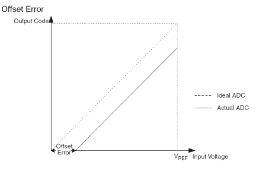
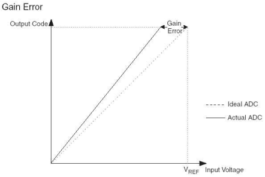
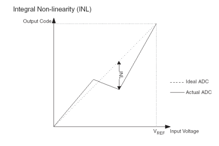
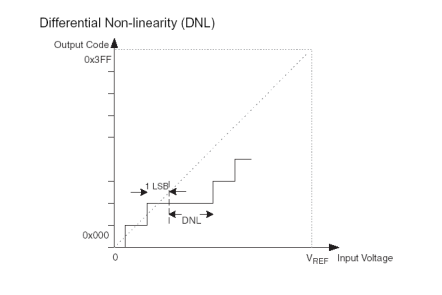

# 아날로그와 디지털
## 1. 아날로그 신호
- ### 아날로그 신호
  - 시간에 따라 연속적으로 변하는 값
  - 정해진 범위 내에서 어떠한 값으로도 표현 가능
  - 주로 물리량 표현에 사용 : 전압, 전류, 온도, 습도 등
## 2. 디지털 신호
- ### 디지털 신호(Digital Signal)
  - 시간에 따라 불연속적인 값
  - 정해진 범위 내에서 특정 값으로만 표현 가능
  - 연속적은 아날로그 값을 디지털로 변환하여 사용
    - 처리하기 용이함
    - 잡음에 강함
    - 시스템 구현이 쉬움
  - 단점
    - 아날로그 신호를 완벽하게 표현할 수는 없음(변환오류가 필연적으로 발생)
## 3. 아날로그 신호의 디지털 변환
- ### 아날로그 신호의 디지털 변환 회로
  - ADC
    - 물리량을 표시하는 아날로그 전기 신호를 디지털 신호로 변환하는 회로
  - DAC
    - 디지털 신호를 연속적인 아날로그 신호로 변환하는 회로
## 3.1 아날로그 신호의 디지털 변환 과정
- ### Sampling & Holding
  - 연속적으로 변화하는 아날로그 신호를 샘플링하여 일정시간동안 유지하는 것
- ### Quantization
  - 샘플한 신호를 디지털 데이터로 표현
    - Resolution
## 아날라고 신호 -> Sampling & Holding -> Quantization -> 디지털 데이터
## 3.2 ADC 동작 예시
- ### Sampling -> Quantization -> Coding
## 3.3 ADC 방법
- ### Direct Conversion ADC
  - 고속의 비교기와 기준 전압 생성을 위한 전압 분배 회로로 구성하는 ADC
    - N-Bit 변환기 : 2N-1개의 비교기 + 2N개의 저항을 사용한 전압 분배회로
  - 가장 빠른 변환 방법
  - 가장 많은 하드웨어 사용
  - 높은 전력 소모
  - Flash ADC, Parallel ADC
- ### Successive Approximation ADC
  - DAC와 비교기를 사용하여 MSB부터 LSV까지 추정하면서 변환
    - EOC : End of Conversion
    - SAR : SA Register
    - S/H : Sample & Holder
  - 비교적 간단한 회로
  - 긴 변환시간
- ### Ramp-compare ADC
  - Free-running 이진 카운터와 DAC 비교기로 구성
    - CTR : 바이너리 카운터
    - SRG : Shift Register
  - 변환 값에 따라 변환 속도 차이가 발생 -> 안정적인 변환 주기 확보 어려움
    - 아날로그 입력 전압이 높으면 변환 시간이 길어지고, 낮으면 변환시간이 짧음.
  - Stairstep-Ramp, Counter ADC
## 3.4 ADC 변환 에러
- ### 양자화 에러(quantization error)
  - 연속적인 아날로그 신호를 유한한 비연속적인 디지털코드로 양자화하기 때문에 필연적으로 발생
- ### 절대 에러
  - 실제 값과 변환 값의 최대 차이값
  - 오프셋 에러, 개인 에러, Integral/Differential Non-linearity 에러
## 3.4.1 Offset 에러
- ### 첫번째 변환(0x00 ~ 0x01) 시, 실제 값과 변환 값 사이이ㅡ 오차
# 
## 3.4.2 Gain 에러
- ### 마지막 변환(0xFE~0xFF)시. 실제 값과 변환 값 사이의 오차
# 
## 3.4.3
- ### Integral Non-linearity
  - 변환 과정에서 발생한 실제 값과 변환 값의 최대 차이값
  - ADC의 선형성 오류
# 
## 3.4.3 DNL 에러
- ### Differential Non-linearity(DNL)
  - 실제 코드 변환폭과 변환시 발생한 변환폭의 최대 차이값
  - 변환폭 : 다음 변환까지 입력신호 변동폭
# 
## 3.5 ADC 선택 기준
- ### 변환 속도 : < 100us(고가)
- ### 해상도(resolution) : 8, 10, 12비트가 일반적
- ### 출력 레벨 : TTL, CMOS
- ### 안정도 : 온도 변화에 따른 변환 안정성
- ### 아날로그 입력 범위
- ### 아날로그 입력 극성(Polarity) : unipoloar, bipolar
# 
---
# 이진법
## 1. 바이너리
- ### 바이너리 : 2개의 상태(0, 1)로 표현되는 숫자, 이진
- ### 2진수 : 바이너리로 표현되는 숫자
- ### 전자회로를 사용한 바이너리 숫자의 표현
  - 전자회로의 전압 값으로 2개의 상태를 구분
  - 