# 목차
- 명령어 실행 하드웨어(1p ~ 9p)
- 명령어 사이클의 RTL 동작(10p~23p) -> 퀴즈!
- 명령어 파이프라인(중요!)(24p~47p)
- 명령어 세트 특성분석(48p ~ 54p)
- CISC(55p ~ 59p)
- RISC(60p ~ 69p)
- 병렬처리 명령어(70p ~ 80p)
# 명령어 실행 하드웨어
## 1. 마이크로 아키텍쳐 개요
- ### 명령어 실행 하드웨어
  - 유연한 디지털 시스템
  - 제어 로직이 가변적(프로그래밍 가능)
- ### 마이크로 아키텍쳐
  - 주어진 명령어 세트 실행에 최적화된 하드웨어 구조
    - 데이터 경로부(Datapath)와 제어 로직(Control Logic)으로 구성
## 2. 마이크로 아키텍쳐 구조
- ### 디지털 시스템 일반
  - 디지털 시스템은 데이터 경로부와 제어부로 구성
  - Datapath
    - 데이터의 흐름 경로
    - 입력->처리->출력
  - Control Logic
    - Datapath의 데이터 흐름을 제어하는 회로
- ### 디지털 시스템 구현 방법
  - Hardwired System
  - Programmable System
# 
## 2.1 Hardwire System
- ### Datapath와 Control Logic을 일체화
  - 유연성 부족
    - 데이터 흐름을 변경하는 것은 곧 시스템 재설계를 의미
  - 실행속도 향상
    - 최적화된 데이터 흐름과 최적화된 제어회로 구현 가능
  - Contol Logic을 로직회로를 사용하여 직접 구현
# 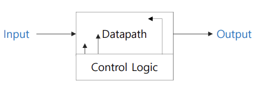
## 2.2 Programmable System
- ### 프로그래밍 가능한 시스템
  - Datapath와 Control Logic 분리
  - 재구성 가능한 Datapath 적용
  - 유연한 Control Logic 구현
    - 시스템 유연성 극대화
    - 실행성능 하락
- ### 유연한 Control Logic
  - Control Signal들을 Control World로 정의
  - Control Word들을 순서적으로 Datapath에 적용
    - 해석기(인터프리터)를 사용하여 Control Word를 Control Signal들로 변환
  - Control Word의 Datapath 적용방법
    - 직접입력
    - 메모리에 저장 후 순서적으로 읽어서 적용
  - 제어방법의 변경
    - Control Word를 재정의하거나 실행 순서를 재정의
# 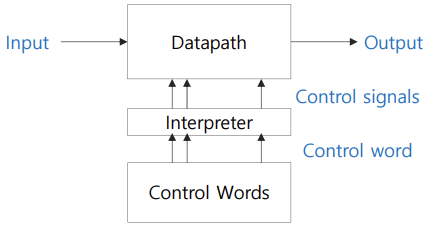
## 2.3 Programmable System과 마이크로 아키텍쳐 관계
- ### 마이크로 아키텍쳐는 대표적인 Programmable System
  - Datapath = ALU + 레지스터
  - Control Word = Instruction(인코딩된 Control Word)
  - Control Word들의 순서적 배열 = 프로그램
  - Control Word의 적용 방법 = 메모리에 저장 후 실행(Stored Program 방식)
  - Control Word 해석기 = Control Unit의 instruction decoder
# 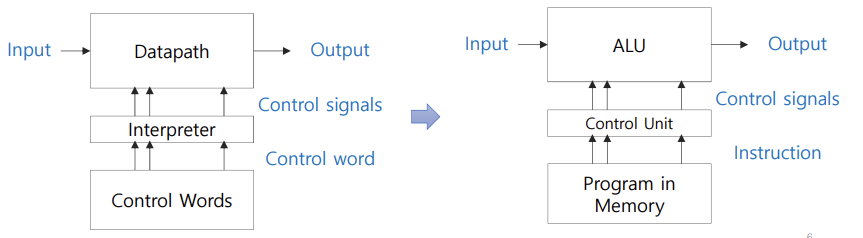
## 3. 마이크로 아키텍쳐의 Datapath
- ### 마이크로 아키텍쳐의 Datapath는 ALU와 레지스터 파일로 구성된다
  - 레지스터 파일 : 레지스터 집합
  - PC : 실행할 명령어의 저장위치 포인터
  - IR : 실행할 명령어 저장
# 
## 4. 마이크로 아키텍쳐의 Control Unit
- ### Control Unit
  - 명령어를 해석하여 명령어 실행에 필요한 제어신호들만을 활성화 시킴.
  - 마이크로 아키텍쳐의 Datapath의 구성요소에 필요한 모든 제어신호 생성
# 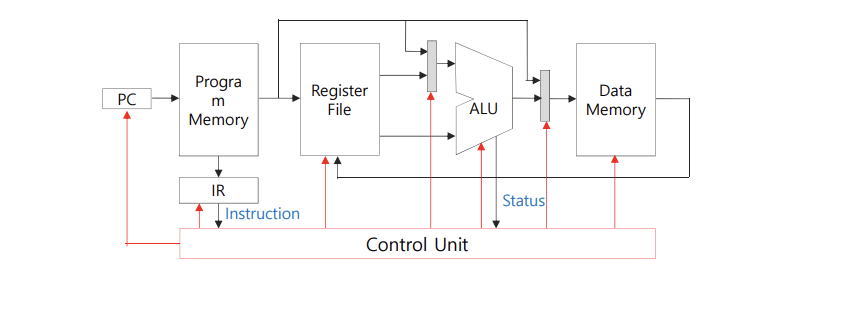
## 4.1 마이크로 아키텍쳐 설계 절차
- ### 마이크로 아키텍쳐 설계 절차
  - 명령어 세트 분석
  - 각 명령어에 대한 micro-operation 정의
  - 모든 micro-operation 실행에 필요한 Datapath 구성요소 및 상호연결 구조 정의
  - Datapath 구성요소 및 연결 회로에 필요한 제어신호 정의
  - Control Unit 설계
    - 명령어 해석기 설계
    - Control Sequencer 설계
    - Control Logic 회로 설계
---
# 정리
1. 명령어 실행 하드웨어는 유연하고 제어 로직이 가변적(프로그래밍 가능)
2. 마이크로 아키텍쳐는 주어진 명령어 실행에 최적화되어있으며, Datapath와 제어 로직으로 구성
3. 디지털 시스템은 Datapath와 Control Logic으로 구성
4. Programmable System과 HardWired System으로 구분됨
5. 
---
# 명령어 사이클의 RTL 동작
- ### 컴퓨터의 명령어 사이클을 RTL 수준에서 설명
- ### 명령어 사이클(예시)
  - Instruction Fetch(IF)
    - 프로그램 메모리에서 명령어 가져오기
  - Instruction Decode(ID)
    - 명령어 해석하기
  - Data Fetch(DF)
    - 명령어 실행에 필요한 데이터 가져오기
  - Execute(EX)
    - 명령어 실행
  - Write Back(WB)
    - 실행 결과 저장
## 1.1 컴퓨터의 RTL 구성요소 예시
- ### 컴퓨터의 명령어 사이클 설명을 위한 컴퓨터 RTL 구성요소
  - PC : 실행할 명령어의 저장정보 위치(어드레스 저장)
  - IR : 실행할 명령어 저장
  - MAR : 메모리 접근에 사용되는 어드레스 저장
  - MBR : 메모리에 읽거나 쓸 데이터 저장
  - R : 데이터 임시 저장용 레지스터
  - ALU : 산술/논리 연산회로
  - 메모리 : 명령어와 명령어 실행에 필요한 데이터 저장
# 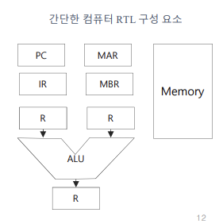
## 1.2 IF 동작 사이클
- ### IF 동작 사이클의 동작
  - 프로그램 메모리에서 명령어를 읽어오는 동작 사이클
    - 명령어의 저장위치에 대한 정보 : PC에 저장
    - 읽어온 명령어의 저장위치 : IR
  - 다음 명령어를 가져오기 위해 PC 값 업데이트
    - PC++ : 어드레스 증가량은 명령어 길이에 따라 다름
    - 실행위치는 t2 또는 t3
# 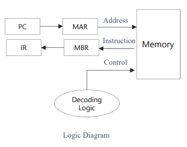
# 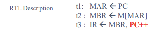
## 1.3 ID 동작
- ### Instruction Decode 동작 사이클의 동작
  - IF 동작 사이클에서 읽어온 명령어를 해석해서 각 컴퓨터 구성요소에서 필요한 제어신호 발생
  - 제어 유니트 구성방법에 따라 ID 동작 사이클에 소요되는 클럭 수가 달라짐
    - 제어신호 직접전잘
      - ID 동작 사이클 생략가능
      - ID 동작 사이클을 IF 동작 사이클에 포함
# 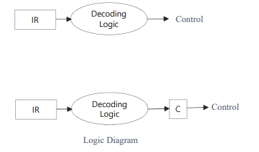
  - 제어신호 Latching
    - 생성된 제어신호를 래치에 저장
# 
## 1.4 OF 동작 사이클
  - ID 동작 사이클에서 해석결과 연산에 필요한 데이터(오퍼랜드)가 필요한 경우, 데이터 메모리에서 데이터를 읽어온다.
  - 실행할 명령어 유형에 따라, 데이터 저장위치 정보(어드레스)의 저장장소와 어드레스 해석 방법이 다르다.
    - 어드레스 저장위치
      - 명령어 레지스터(IR)
      - 또 다른 레지스터 : 인덱스 레지스터
      - 메모리 : 어드레스가 메모리에 저장되어 있는 경우. 다양한 어드레싱 방법 적용
    - 어드레스 해석방법
      - 어드레싱 모드에 따라 다름 : 직접 어드레싱, 간접 어드레싱
- ### OF 동작 사이클의 동작(계속)
  - 오퍼랜드 접근을 위한 어드레스 계산이 필요한 경우, 어드레스 계산 사이클이 추가될 수 있음.
# 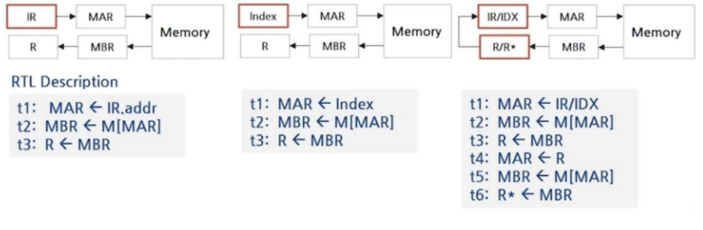
## 1.5 EX 동작 사이클
- ### EX(Execute) 동작 사이클의 동작
  - ID 동작 사이클에서 해석 결과에 따라 필요한 연산을 수행한다.
    - 연산 유형 : 산술 논리 연산, 데이터 전송
  - 실행할 연산 유형에 따라 실행시간 차이 발생
# 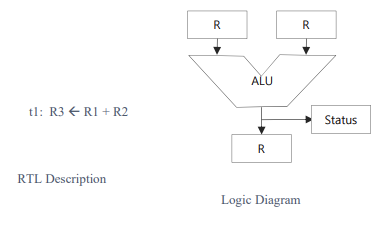
## 1.6 WB 동작 사이클
- ### Write Back(EX) 동작 사이클의 동작
  - EX 실행결과를 레지스터 또는 메모리에 저장한다.
    - 레지스터에 저장하는 경우, 레지스터 구조에 따라 WB 사이클이 불필요할 수 있음.
    - 메모리에 저장하는 경우, OF 동작사이클처럼 다양한 어드레싱 방법을 사용할 수 있음.
## 2. 제어 유니트 설계
- ### 제어 유니트
  - 각 구성요소에서 필요한 제어신호를 발생시키는 회로
- ### 제어 유니트 출력신호
  - RTL 동작제어에 필요한 제어신호
  - 레지스터 제어신호 : LOAD 신호
  - ALU 제어신호 : 연산 선택 신호
  - 레지스터 상호 연결에 필요한 제어 신호
    - 연결 유형에 따라 멀티플렉서 선택 제어신호 또는 3-STATE 버퍼의 제어신호
- ### 제어유니트 입력신호
  - 명령어 해석 결과 신호 : ID 동작 사이클에서 실시한 명령어 해석 결과 신호
  - ALU 연산 결과 신호 : EX 동작 사이클에서 발생한 연산 결과에 따른 상태 신호
  - 타이밍 신호 : 제어 유니트에서 생성하는 타이밍 신호
## 2.1 제어 유니트의 타이밍
- ### 제어 유니트에 발생하는 제어신호들은 제어 타이밍에 맞추어 활성화된다.
- ### 제어 타이밍 결정 요소
  - 명령어 해석 결과
  - 명령어 사이클을 구성하는 동작 사이클 타이밍
    - 동작 사이클 타이밍 발생기에서 동작 사이클 타이밍 신호 발생
  - 동작 사이클을 구성하는 MOP 수준 타이밍
    - MOP 레벨 타이밍 발생기에서 MOP 실행 타이밍 신호 발생
## 2.2 동작 사이클 타이밍 생성
- ### 동작 사이클 타이밍 발생기(Operation Cycle Timing Generator)
  - 명령어 사이클을 구성하는 최대 동작 사이클
  - 타이밍 상태 천이는 카운터로 구현
    - cf) 명령어 사이클을 구성하는 최대 동작 사이클 수 = 5인경우, 3비트 이진 카운터로 구성.
# 
## 2.3 MOP-레벨 타이밍 생성
- ### MOP-레벨 타이밍 발생기
  - 동작 사이클을 구성하는 최대 MOP 레벨 동작의 수에 의해 결정
  - 디코더를 사용하여 MOP 레벨 타이밍 신호를 활성화
  - CF) 명령어 사이클을 구성하는 동작 사이클이 최대 3개의 MOP-레벨 동작으로 구성되었다면, 2비트 카운터로 구현.
# 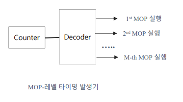
## 2.4 제어 회로 구현
- ### 제어신호들은 제어 타이밍에 맞추어 제어 타깃에 적용된다.
# 
- ### 실제 구현 예
# 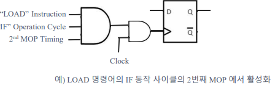